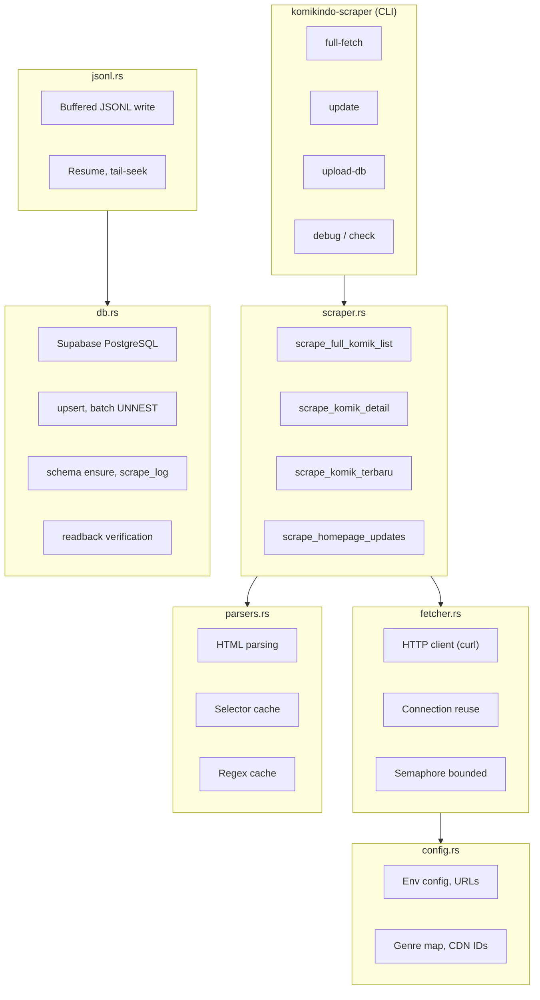
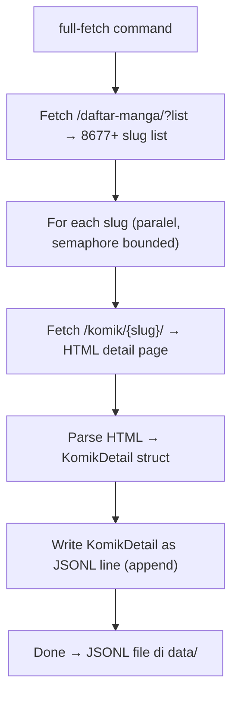
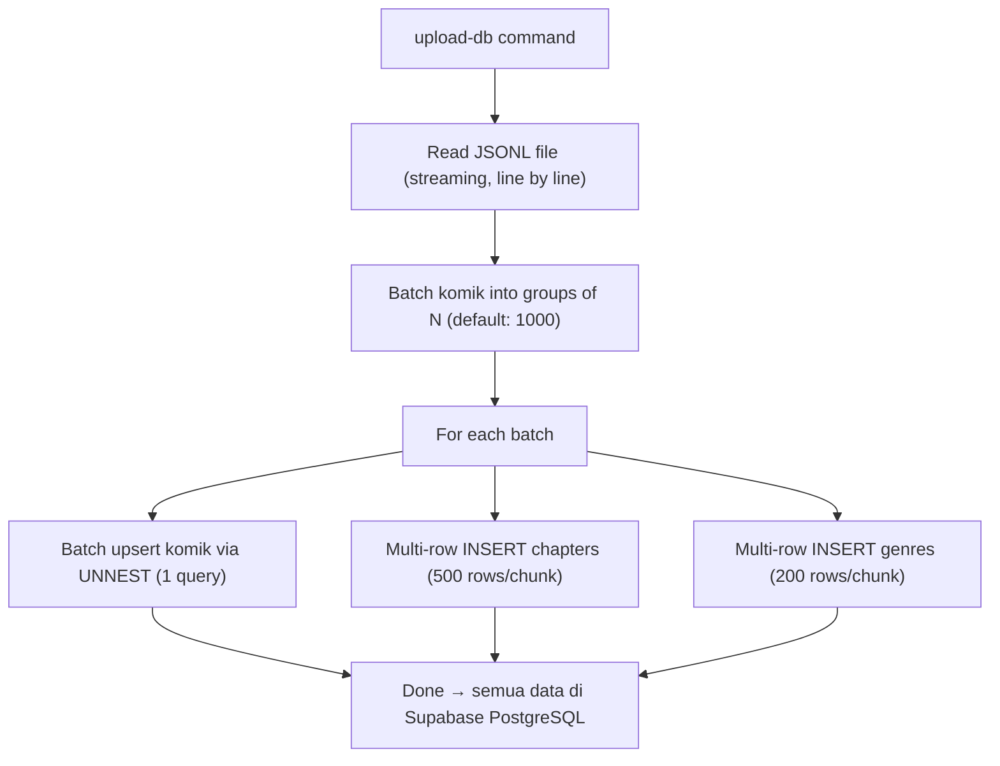
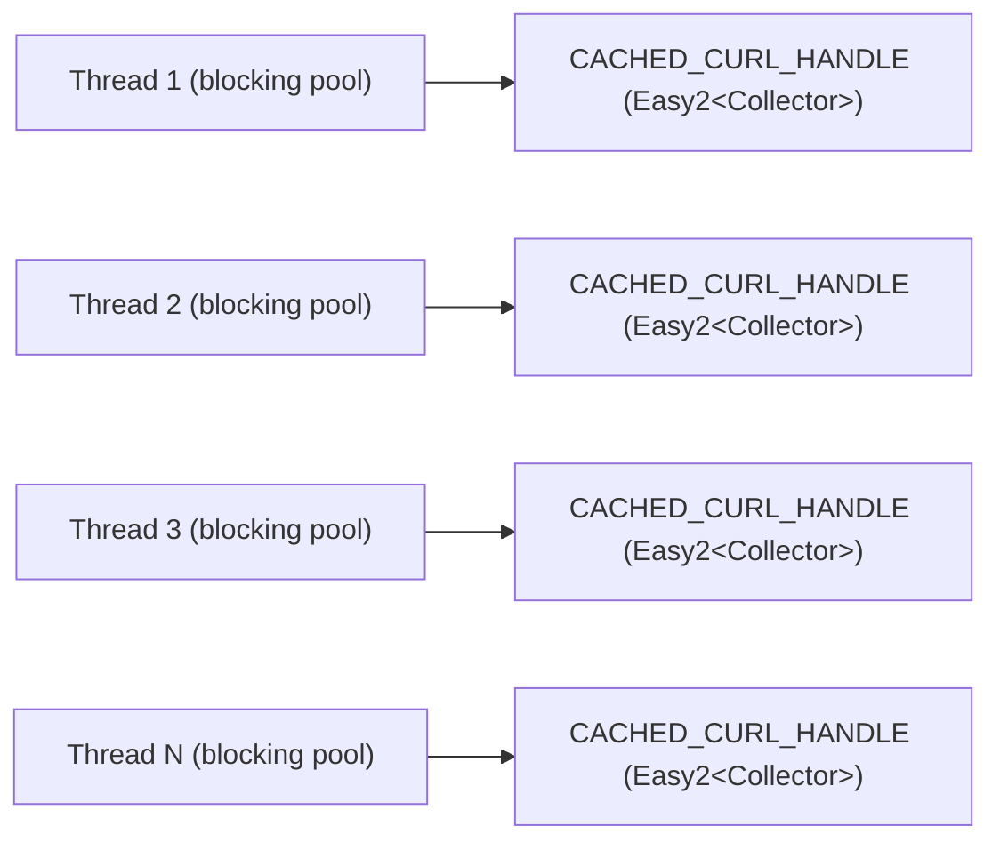
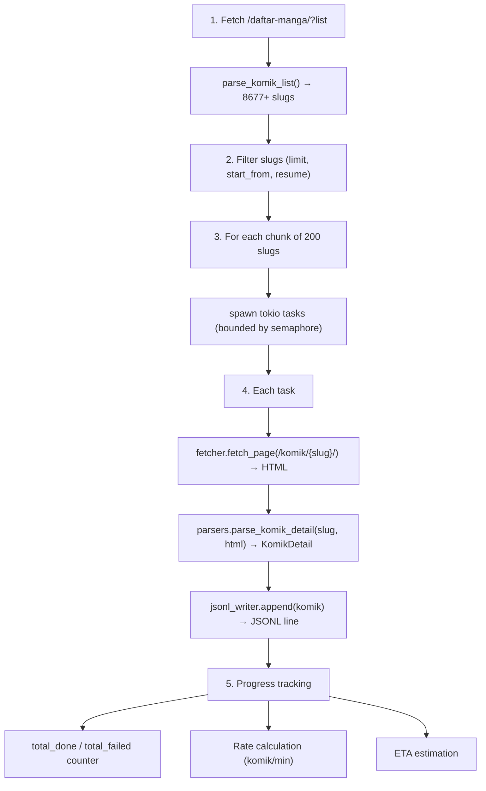
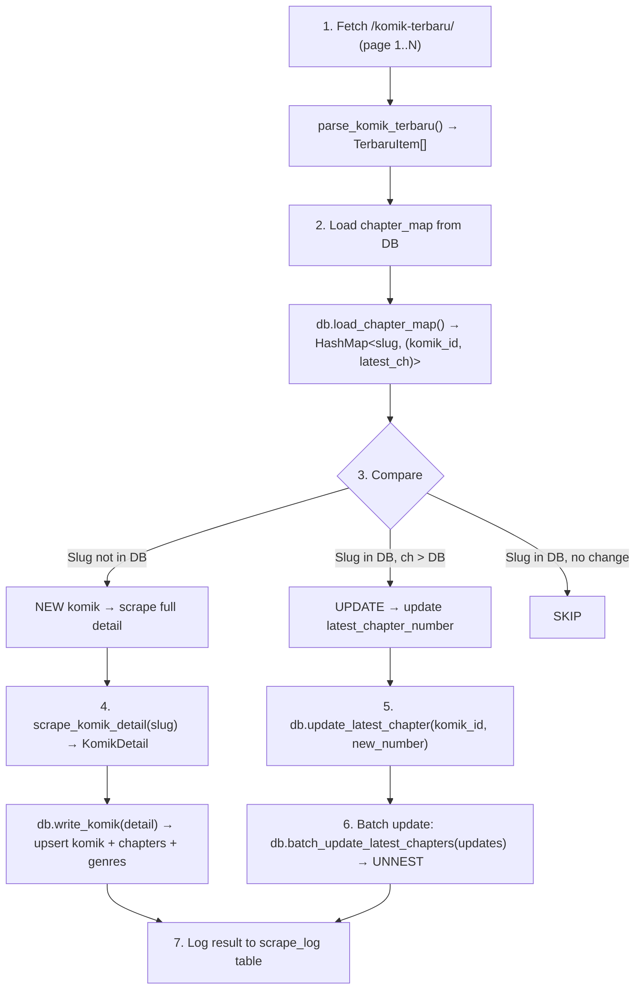
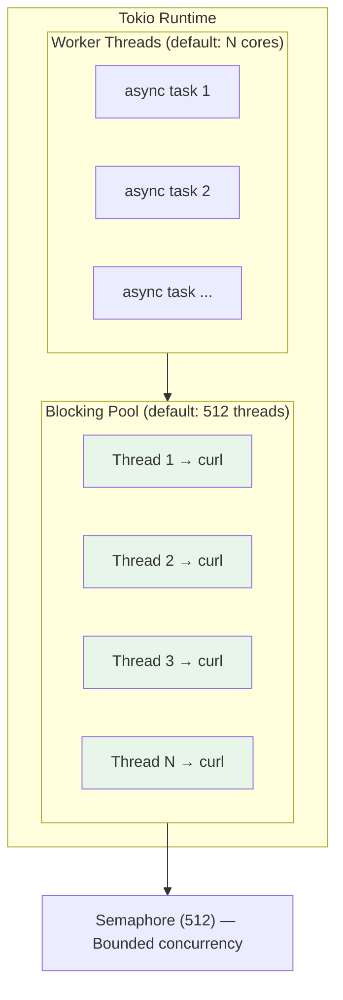

# Arsitektur KomikIndo Scraper

Dokumen ini menjelaskan arsitektur detail, data flow, dan desain setiap module dalam proyek komikindo-scraper-rust.

---

## High-Level Architecture

---

## Two-Phase Pipeline

Proyek ini menggunakan **two-phase pipeline** untuk memisahkan data fetching dari database writes. Desain ini memberikan beberapa keuntungan:

1. **Phase 1 ringan** — hanya HTTP + parse + write JSONL, tanpa DB write yang bisa menjadi bottleneck
2. **Crash-safe** — JSONL bersifat append-only, data tidak hilang jika proses crash
3. **Resume-friendly** — bisa lanjut dari slug terakhir tanpa re-fetch
4. **Fleksibel** — bisa import ke DB kapan saja, atau tidak sama sekali

### Phase 1: Fetch → JSONL

### Phase 2: JSONL → Database

---

## Module Detail

### `main.rs` — CLI Entry Point

CLI entry point menggunakan `clap` derive macro. Bertanggung jawab untuk:

- **CLI parsing** — semua subcommands dan flags
- **Runtime configuration** — Tokio worker threads, blocking threads, log level
- **Command dispatch** — route ke runner function yang sesuai
- **Full fetch runner** — orchestrates the full-fetch pipeline (get slugs → spawn tasks → write JSONL)
- **Update runner** — smart incremental update (fetch terbaru → compare with DB → upsert changes)
- **DB management** — db-setup, db-show, db-reset, db-drop-all, upload-db
- **Diagnostics** — debug, check, bench-parse

Key structures:
- `Cli` — Top-level CLI args (verbose, env, worker_threads, max_blocking_threads, max_in_flight)
- `Commands` — Enum of all subcommands
- `FullFetchOpts` / `UpdateOpts` / `DebugOpts` — Options structs

### `config.rs` — Configuration & Constants

Menyimpan semua konstanta dan konfigurasi yang digunakan seluruh aplikasi:

- **`BASE_URL`** — `https://komikindo.ch`
- **`EnvConfig`** — Database URL, proxy URL, retries, timeout (loaded from `.env`)
- **`.env` loading** — Multi-path search (explicit, CWD, binary dir, parent dirs)
- **URL builders** — `build_komik_url()`, `build_chapter_url()`
- **CDN domain maps** — `cdn_domain_to_id()`, `cdn_id_to_base_url()` (4 CDN domains)
- **Status map** — Berjalan=1, Tamat=2
- **Genre map** — 82 genre hardcoded dengan ID mapping
- **Thumbnail constants** — WP prefix, Komik prefix, dimension stripping

**Important:** `EnvConfig` di-cache sekali menggunakan `LazyLock` — semua akses `env_config()` mengembalikan reference ke static config.

### `fetcher.rs` — Async HTTP Client

Module inti untuk HTTP fetching. Menggunakan `curl` crate (libcurl binding) dengan optimisasi ekstensif:

**Thread-Local Handle Cache:**

Setiap thread di blocking pool mempertahankan curl handle-nya sendiri. Request pertama membuat handle baru (TCP+TLS handshake ~100-200ms), request berikutnya reuse koneksi yang sama (~0ms overhead).

**Key optimizations:**
- **Semaphore bounded concurrency** — `Arc<Semaphore>` membatasi in-flight requests
- **Connection reuse** — handle di-cache di thread-local, HTTP keep-alive aktif
- **TCP_NODELAY** — disable Nagle's algorithm, send headers immediately
- **HTTP/2 pipewait** — wait for multiplexing before opening new connection
- **FORBID_REUSE on 429** — close rate-limited connection, keep handle for reuse
- **maxage_conn 120s** — close idle connections after 120 seconds
- **DNS cache 3600s** — avoid repeated DNS lookups
- **Pre-allocated Collector** — 256KB buffer, avoid re-allocation
- **Zero-copy response** — `UnsafeCell<Vec<u8>>` take data without clone
- **Fast UTF-8** — checked conversion, not lossy
- **Cached headers** — static strings, rebuild only List nodes per handle
- **CA bundle detection** — platform-aware (Linux, macOS, Termux)

**Retry logic:**
- Default 3 retries dengan exponential backoff
- Longer backoff (2s) untuk rate-limited requests (HTTP 429)
- Shorter backoff (0.3s × attempt) untuk network errors

### `parsers.rs` — HTML Parsing

Semua parsing HTML menggunakan `scraper` crate dengan optimisasi LazyLock:

**Cached statics:**
- 15+ CSS selectors (`Selector::parse()` cached as `LazyLock`)
- 10+ regex patterns (`Regex::new()` cached as `LazyLock`)
- Genre map (`HashMap<&str, i16>` — 82 entries, cached once)

**Parse functions:**
- `parse_komik_list()` — Parse `/daftar-manga/?list` → slug list (8000+ entries)
- `parse_komik_detail()` — Parse detail page → KomikDetail (title, type, thumb, info, genres, chapters)
- `parse_homepage_updates()` — Parse homepage → recent updates
- `parse_komik_terbaru()` — Parse `/komik-terbaru/` → items with time info
- `parse_chapter_images()` — Parse chapter read page → CDN image URLs (unused in Method 2)

**Chapter URL fix:**
- Python version: construct URL manually from slug + chapter_number (sering salah)
- Rust version: extract URL langsung dari `<a href>` di detail page (selalu benar)

**Data structures:**
- `KomikDetail` — Full komik metadata + chapters + genres
- `ChapterInfo` — Chapter number + URL (+ optional image data)
- `HomepageUpdate` — Slug, judul, latest chapter, tipe, thumbnail
- `TerbaruItem` — Slug, judul, chapter number, URL, time info

### `db.rs` — Database Operations

Semua operasi database menggunakan `sqlx` dengan PostgreSQL:

**Connection management:**
- Auto-redirect PgBouncer port 6543 → direct port 5432 (prepared statements support)
- Connection pool: max 50 connections, 30s acquire timeout, 5min idle timeout
- SSL mode: Prefer (try TLS, fallback to plaintext)

**Write operations:**
- `upsert_komik()` — Single komik upsert (INSERT ON CONFLICT DO UPDATE, atomic)
- `upsert_chapters()` — Batch chapter upsert (multi-row INSERT, 500 rows/chunk)
- `sync_genres()` — Delete + re-insert genres (transactional)
- `write_komik()` — Full write: upsert komik + chapters + genres
- `batch_write_komik()` — Batch write menggunakan UNNEST (Phase 2)
- `batch_update_latest_chapters()` — Batch update via UNNEST

**Read operations:**
- `load_chapter_map()` — Load slug → (komik_id, latest_chapter) untuk smart update
- `list_komik()` / `list_chapters()` / `get_komik_id_by_slug()` — Readback queries
- `get_komik_detail_by_slug()` — Full detail with chapters + genres

**Schema management:**
- `setup_schema()` — CREATE TABLE IF NOT EXISTS + indexes + triggers
- `ensure_schema()` — ADD COLUMN IF NOT EXISTS (safe, idempotent)
- UNIQUE constraint pada `chapters(komik_id, chapter_number)`
- Auto-update triggers untuk `updated_at` (komik + chapters)

### `scraper.rs` — High-Level Scrape Logic

Module orchestration yang menggabungkan fetcher + parsers:

- `scrape_full_komik_list()` — Fetch + parse full slug list
- `scrape_komik_detail()` — Fetch + parse single komik detail (no spawn_blocking — cached selectors make parsing fast)
- `scrape_chapter_images()` — Fetch + parse chapter images (unused in Method 2)
- `scrape_homepage_updates()` — Fetch + parse homepage
- `scrape_komik_terbaru()` — Fetch + parse `/komik-terbaru/` with auto-pagination

**Smart update pagination logic:**
1. Fetch page 1 dari `/komik-terbaru/`
2. Cek item terakhir — kalau waktu < max_age_minutes, lanjut page 2
3. Ulangi sampai max_pages tercapai atau item terakhir sudah lama
4. Dedup slugs dengan HashSet

### `jsonl.rs` — JSONL I/O

File-based data storage yang crash-safe dan resume-friendly:

- `BufferedJsonlWriter` — Thread-safe buffered writer (parking_lot::Mutex + BufWriter 1MB)
- Thread-local serialization buffer — reuses same Vec across calls (saves ~2μs/alloc)
- `last_slug_from_jsonl()` — Tail-seek optimization: baca 64KB terakhir, bukan seluruh file
- `find_latest_jsonl()` — Cari JSONL terbaru berdasarkan modification time
- `load_db()` / `save_db()` — Full HashMap load/save (untuk local-only mode)

---

## Data Flow

### Full Fetch Flow

### Smart Update Flow

---

## Concurrency Model

**Key design decisions:**
- `max_blocking_threads == max_in_flight` untuk optimal connection reuse
- Semaphore limits in-flight requests, bukan spawned tasks
- Chunked task spawning (200/chunk) untuk menghindari OOM
- Parsing berjalan inline di async task (bukan spawn_blocking) karena cached selectors membuat parsing sangat cepat (~0.1ms)

---

## Error Handling Strategy

| Error Type | Strategy |
|------------|----------|
| HTTP network error | Drop handle, retry with fresh connection |
| HTTP 429 (rate limit) | FORBID_REUSE + retry with longer backoff (2s) |
| HTTP 4xx/5xx | Cache handle (TCP still valid), retry with backoff |
| Cloudflare challenge | Bail immediately (no retry — need proxy) |
| DB connection fail | Fallback to JSONL mode |
| DB query fail (transaction) | Rollback, log error, continue |
| Parse fail | Skip komik, log warning, increment failed counter |
| JSONL write fail | Fatal — cannot proceed without output |

---

## Memory Management

- **jemalloc** — Global allocator untuk Linux/macOS (5-15% improvement)
- **Arc<str>** — Shared proxy URL dan CA bundle path
- **Arc<Semaphore>** — Shared semaphore reference
- **Arc<AtomicFetcherStats>** — Lock-free stats counters
- **UnsafeCell<Vec<u8>>** — Zero-copy response data in Collector
- **Thread-local serialize buf** — Reuse serialization buffer in JSONL writer
- **Pre-allocated Vec::with_capacity()** — Throughout parsers dan DB operations
- **parking_lot::Mutex** — Lighter than std::sync::Mutex untuk JSONL writer
